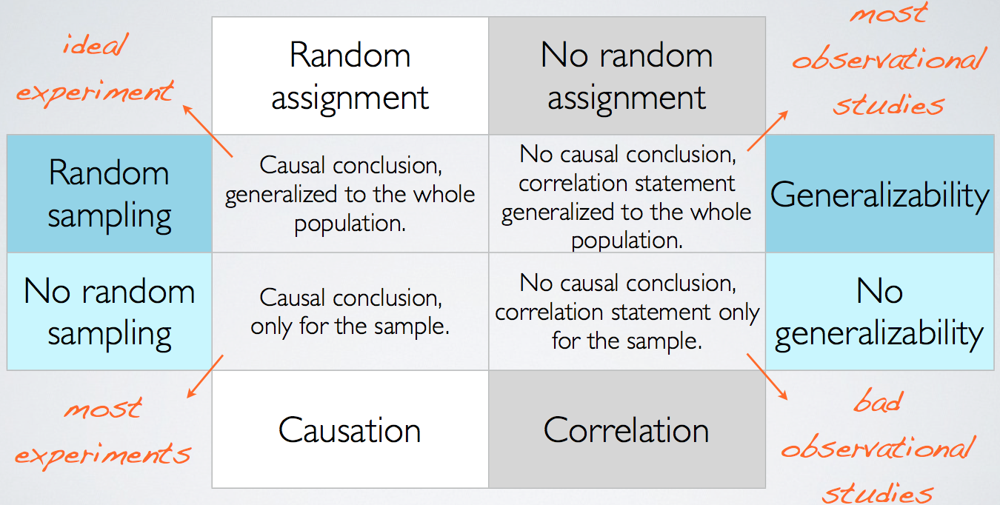

<style>
citation {
  font-size: 4px;
}
</style>

<!--  Version 1.0-0

      This version of the slides is taken from Mine Çetinkaya-Rundel's lecture slides
      posted on OpenIntro.org in .pptx and .gdslides format, and moved to Rmd. Originally done
      as a translation for github.com/wesleyburr/introstat_random/. Some material added throughout,
      and some things cleaned up.
      
      A large part of the HTML/CSS formatting is janky, and could be cleaned up. Feel free to issue a 
      pull request if you love HTML and CSS and want to fix this up.
      
      - wburr, Sept 11, 2018
-->

# Course Overview and Reminders

## Deadlines

* September 18th - WeBWorK Assignment #01 - vocab from today, and readings
* September 21st - Academic Integrity Module
    - you do **not** need to submit your completion or grade, it's automatic

## Coming Up

* workshop tonight or tomorrow - introduction to the RStudio interface
    - if you still don't have RStudio installed, or have figured out how to use the VCC,
      this is top priority!
* asynchronous lecture for Friday morning, with examples of observational studies and 
experiments

## Questions?

<!-- Chapter 1.2 -->
# Data Basics

## Types of variables (cont.)

```{r, out.width = "650px", echo = FALSE}

```

## Numerical Data

**Numerical (or quantitative) data** are *numbers* representing counts or measurements.

* Weights of athletes
* Number of siblings
* GPA

## Working with Numerical Data

We can further distinguish between numerical data by breaking them into two types:

* **discrete** numerical data (integers)
* **continuous** numerical data (real numbers)

## Categorical Data

**Categorical (or qualitative) data** are *names or labels* (categories!)

* country codes for telephones (e.g., USA and Canada are 1)
* Social Insurance Numbers (e.g., 516 248 917 - Canadian system)
* car colours (red, blue, green, ... fuscia?)

## Ordinal Data

**Ordinal Data** are categorical data which have a natural order structure

* days of the week (Sunday, Monday, ...)
* months of the year (January, February, ...)
* letter grades (A, B, C, D, F)
* ranking scheme (Excellent, Good, Fair, Poor)

<!-- Chapter 1.3 -->
# Overview of Data Collection Principles

## Census

* Wouldn't it be better to just include everyone and "sample" the entire population?
  * This is called a **census**
* There are problems with taking a census:
  * It can be difficult to complete a census: there always seem to be some individuals who are hard to locate or hard to measure. And these difficult-to-find people may have certain characteristics that distinguish them from the rest of the population.
  * Populations rarely stand still. Even if you could take a census, the population changes constantly, so it's never possible to get a perfect measure.
  * Taking a census may be more complex than sampling.
 
## Exploratory analysis to inference

* Sampling is natural.
* Think about sampling something you are cooking - you taste (examine) a small part of what you're cooking to get an idea about the dish as a whole.
*  When you taste a spoonful of soup and decide the spoonful you tasted isn't salty enough, that's **exploratory analysis**.
* If you generalize and conclude that your entire soup needs salt, that's an inference.
* For your inference to be valid, the spoonful you tasted (the sample) needs to be representative of the entire pot (the population).
* If your spoonful comes only from the surface and the salt is collected at the bottom of the pot, what you tasted is probably not representative of the whole pot.
* If you first stir the soup thoroughly before you taste, your spoonful will more likely be representative of the whole pot.

## Sampling Errors

There are a number of ways things can go wrong. Some examples:

* non-response
* self-selection
* framing bias
* sensitive topics
* interviewer bias
* timing

More details in a **handout** that will be posted on Blackboard.

## Methods of Collecting Data
<div style="font-size: 24px;">
**Observational study**: Researchers collect data in a way that does not directly interfere with how the data arise, i.e. they merely "observe", and can only establish an association between the explanatory and response variables.

**Experiment**: Researchers randomly assign subjects to various treatments in order to establish causal connections between the explanatory and response variables.

If you're going to walk away with one thing from this class, let it be "correlation does not imply causation".

<!-- Chapter 1.4 -->
# Observational studies and sampling strategies

## Prospective versus Retrospective Studies

A **prospective study** identifies individuals and collects information as events unfold. 

* **Example**: The Nurses Health Study has been recruiting registered nurses and then collecting data from them using questionnaires since 1976.

**Retrospective studies** collect data after events have taken place.

* **Example**: Researchers reviewing past events in medical records.

## Obtaining Good Samples
Almost all statistical methods are based on the notion of implied randomness. 

If observational data are not collected in a random framework from a population, these statistical methods -- the estimates and errors associated with the estimates -- are not reliable.

Most commonly used random sampling techniques are **simple**, **stratified**, and **cluster** sampling.

## Simple Random Sample

Randomly select cases from the population, where there is no implied connection between the points that are selected.

<div style="margin: auto; width: 100%; text-align: center;">
```{r, echo=FALSE, out.width = "700px"} 
knitr::include_graphics("fig/fig_1_4_simple_random.png")
```
</div>

## Stratified Sample
Strata are made up of similar observations. We take a simple random sample from each stratum.
 
<div style="margin: auto; width: 100%; text-align: center;">
```{r, echo=FALSE, out.width = "700px"} 
knitr::include_graphics("fig/fig_1_4_stratified.png")
```
</div>

## Cluster Sample
Clusters are usually not made up of homogeneous observations, and we take a simple random sample from a random sample of clusters. Usually preferred for economical reasons.

<div style="margin: auto; width: 100%; text-align: center;">
```{r, echo=FALSE, out.width = "700px"} 
knitr::include_graphics("fig/fig_1_4_cluster.png")
```
</div>

# Experiments

## Principles of Experimental Design
Studies where researchers assign treatments to cases are called **experiments**. If the assignment of treatments to cases (e.g., using a coin flip to determine which treatment a patient receives), the study is called a **randomized experiment**. 

Randomized experiments have a series of four principles.

## Principle 1: Controlling

Researchers assign treatments to cases, and do their best to **control** for other differences between groups. 

**Example**: in a drug trial, patients may be asked to take a pill daily. Some may take the pill dry (ick!), some with just a sip of water, some with coffee, and others with juice. To **control** for the effect of accompanying liquid, a doctor may ask all patients to drink a 12 oz glass of water with the pill.

## Principle 2: Randomization

Researchers **randomize patients** into treatment groups to account for variables that cannot be controlled. 

**Example**: some patients are more susceptible to disease than others due to dietary habits. **Randomizing** patients into treatment/control groups helps even out these differences, possibly preventing accidental bias.

## Principle 3: Replication

The more cases researchers observe, the more accurately they can estimate the effects of explanatory variables on response variables. In a single study, we **replicate** by collecting a sufficiently large sample. Additionally, scientists often replicate an entire study over again to verify earlier findings.

## Principle 4: Blocking

Researchers sometimes know (or suspect) that variables other than the treatment influence the response. Under this situation, they may first group individuals by this variable, and then randomize cases within each block. 
This is known as **blocking**.

**Example**: If we were researching the effect of a drug on heart attacks, we might first split patients into high-risk and low-risk **blocks** (based on diet, physique, genetic screening, or some other approach), and *then* randomly assign half of each block to the control group, and the other half to the drug (treatment) group.

## More Experimental Design Terminology

**Placebo**: fake treatment, often used as the control group for medical studies

**Placebo effect**: experimental units showing improvement simply because they believe they are receiving a special treatment

**Blinding**: when experimental units do not know whether they are in the control or treatment group

**Double-blind**: when both the experimental units and the researchers who interact with the patients do not know who is in the control and who is in the treatment group


## Random Assignment versus Random Sampling
<div style="float:center; position:relative; left:100px; top:30px;">
```{r, out.width = "800px", echo = FALSE}

```
</div>
