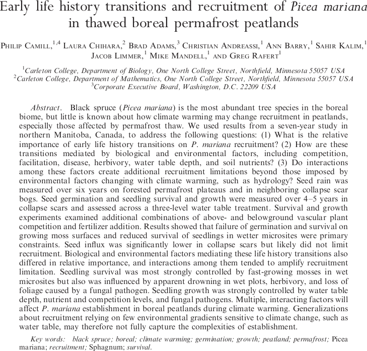
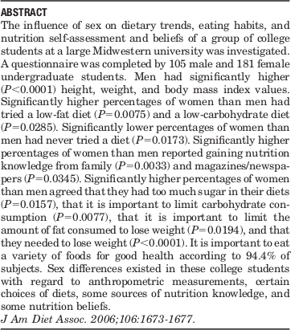
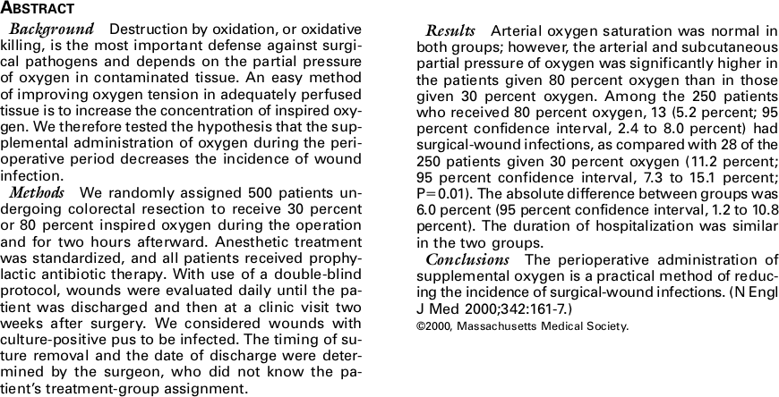
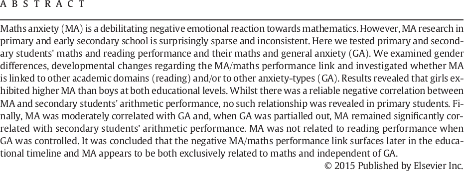

<style>
citation {
  font-size: 4px;
}
</style>

<!--  Version 1.0-0

      This version of the slides is taken from Mine Çetinkaya-Rundel's lecture slides
      posted on OpenIntro.org in .pptx and .gdslides format, and moved to Rmd. Originally done
      as a translation for github.com/wesleyburr/introstat_random/. Some material added throughout,
      and some things cleaned up.
      
      A large part of the HTML/CSS formatting is janky, and could be cleaned up. Feel free to issue a 
      pull request if you love HTML and CSS and want to fix this up.
      
      - wburr, Sept 11, 2018
-->

# Experiments and Observational Studies

## Today's Topic

Today we will be revisiting the ideas of experiments, experimental design,
observational studies, and sampling, from the lens of actual scientific experiments.
Each of the examples explored today will be taken from an actual scientific paper,
and all of the original papers have been made available to you on Blackboard.

# Studies

## Study 1

**Early life history transitions and recruitment of** ***Picea mariana***
**in thawed boreal permafrost peatlands**

Camill, Chihara, Adams, Andreassi, Barry, Kalim, Limmer, Mandell and Rafert (2010)

## Study 1: Abstract

<div style="margin: auto; width: 100%; text-align: center;">
```{r, echo=FALSE, out.width = "700px"} 

```
</div>

## Study 1

What can we say about this study?

* 7 year study
* Manitoba, Canada
* studying black spruce (*Picea mariana*)
* climate warming, permafrost
* "recruitment" in peatlands

## Do we know what kind of study it is?

Experiment or observational study?

Seed germination and seedling survival and growth were measured over 4–5 years in collapse scars and assessed across a three-level water table treatment. Survival and growth experiments examined additional combinations of above- and belowground vascular plant competition and fertilizer addition

## More Details (from the paper)

Seed rain was measured over six years (1997–2002)
using traps located randomly on permafrost plateaus
and neighboring collapse scars to quantify P. mariana
fecundity on plateaus and dispersal into neighboring
collapse scars. Stand densities on plateaus ranged from
5000–8000 trees per hectare in this region (Camill 1999a,
Camill et al. 2001). Seed traps were 0.17 m 2 polypropyl-
ene boxes lined with fiberglass mesh. Traps were placed in three replicate plateau/scar sites (Fig. 1B) in each of four study zones for a total of 12 sites in the seed rain analysis. Each site contained 10 plateau traps and five scar traps for the first two years (1997–1998), but the number of collapse scar traps per site was increased to 15 from 1999 to 2002 for better spatial coverage and sampling intensity.

## More Details

**Germination, growth and survival experiments**

Seed germination and seedling survival and growth in
thawed collapse scars were measured over 4–5 years
following experimental additions of seeds and seedlings
in a single peatland landscape (Fig. 1C). We located 15
accessible collapse scar sites separated by distances of
100 m to 5 km. We stratified each site into three water table depth categories, 
corresponding to the dominance
of three Sphagnum species: wet (;0–10 cm, S. riparium),
medium (;15–25 cm, S. angustifolium), and dry (;25–
50 cm, S. fuscum). Thirty plots were located in each of
the wet, medium, and dry water table microhabitats for
a total of 90 plots in the 15 collapse scar sites. We placed
multiple plots in larger collapse scar sites to constrain
random variability, but to avoid pseudoreplication, we
averaged data from multiple plots per water table
treatment to generate a single mean per site, and we handled site, water table categories, and plot treatments as random effects in statistical analysis (see Methods: Statistical analyses).

## More Details

We also measured P. mariana seedling survival and
growth over a five-year period by transplanting 2160
one-year-old, containerized nursery seedlings grown
from seed collected within 80 km from the study site
(Tolko Industries, The Pas, Manitoba and Pineland
Nurseries, Hadashville, Manitoba, Canada). 
A randomized $3\times 2\times 2$ split–split plot design was established by first stratifying plots across three levels of water table depth, then subdividing each plot into four subplots randomly assigned to all combinations of a two-level nutrient amendment treatment
(fertilized/unfertilized) and a two-level above- and belowground vascular plant
competition experiment (competition removed/competition present).

## Conclusion

1. This was definitely an experiment
2. Randomization was used
3. Stratification was applied on the sites
4. Something called a "split-split plot design" was used
5. Treatments mentioned - nutrient amendment, above- and below-ground plant competition,
and water level

No blinding, blocking, or placebo - this wasn't a study on people, and blocking wasn't
required (although stratification produced an additional treatment variable, which was
of interest)

## Study 2

**Sex Differences in Dieting Trends, Eating Habits, and Nutrition Beliefs of a Group of Midwestern College Students**

Davy, Benes and Driskell (2006)

## Study 2: Abstract

<div style="margin: auto; width: 100%; text-align: center;">
```{r, echo=FALSE, out.width = "450px"} 

```
</div>


## Study 2

What can we say about this study?

* questionnaire
* 105 male, 181 female
* comparing men to women
* lots of "P" things?

## Do we know what kind of study it is?

Experiment or observational study?

A 21-item questionnaire was developed that assessed
self-reported anthropometric measurements, use of specific diets ... the questionnaire was pilot-tested with 10 undergraduate students to
clarify language and response options. Eleven students
completed the questionnaire again after 4.5 weeks; responses were the same 78% of the time.
Participants were recruited from an introductory nutrition 
course during the fourth week of the 2005 spring
semester; 100% of eligible students participated and all
signed informed consent forms. Each subject’s classification and college was obtained from class rosters and compared with that of the university’s undergraduate population (17).

## More Details

Several sex differences in anthropometric measurements
and certain choices of diets, sources of nutritional knowledge, and nutrition were observed in a group of college students. These college men and women seemingly related to some nutrition issues differently. Registered dietitians and other health professionals should take these
differences into account when developing nutrition education materials and designing nutrition intervention programs for college students and other young adults.

## Study 3

**Supplemental Perioperative Oxygen To Reduce The Incidence of Surgical-Wound Infection**

GREIF, AKÇA Horn, Kurz, Sessler, for the Outcomes Research Group (2000)

## Study 3: Abstract

<div style="margin: auto; width: 100%; text-align: center;">
```{r, echo=FALSE, out.width = "700px"} 

```
</div>

## Study 3

What can we say about this study?

* random assignment of 500 patients
* 30% or 80% inspired oxygen
* double-blind protocol
* some stats-y sounding stuff

## Do we know what kind of study it is?

Experiment or observational study?

After the induction of anesthesia and endotracheal intubation,
each patient was assigned to one of two groups through the use
of a set of computer-generated random numbers. The assignments
were stratified according to the participating hospital and were kept
in sealed, sequentially numbered envelopes until used. One group
of patients received 30 percent oxygen and 70 percent nitrogen; the
other group received 80 percent oxygen and 20 percent nitrogen.

## More Details

The anesthesiologists who cared for the patients were aware of
their treatment-group assignments. However, cardboard shields were
positioned over flowmeters and relevant monitors to prevent the
surgical team from determining the fraction of inspired oxygen. Two
hours after a patient’s recovery from anesthesia, the record of the administration of anesthesia and the blood gas results were sealed so
that the surgeons and investigators who evaluated the wounds post-operatively would be unaware of the patients’ treatment-group assignments. Patients were not informed of their group assignments.

## More Details

From July 1996 to October 1998, we enrolled 500
patients, 223 (45 percent) at the Donauspital (Vienna,
Austria), 213 (43 percent) at the University of Vienna
(Vienna, Austria), and 64 (13 percent) at the University Hospital Eppendorf (Hamburg, Germany).
Enrollment in the study was discontinued after 500
patients had been enrolled because the incidence of
surgical-wound infection in the two groups differed
significantly (P<0.012).

## More Details

In summary, the administration of supplemental
oxygen during colorectal resection and for two hours
afterward halved the incidence of surgical-wound infection. Because the cost of and risk associated with
supplemental perioperative oxygen are trivial, the provision of supplemental oxygen appears to be a practical method of reducing the incidence of this dangerous and expensive complication.

## Study 4

**Maths anxiety in primary and secondary school students: Gender differences, developmental changes and anxiety specificity**

Hill, Mammarella, Devine, Caviola, Passolunghi and Szűcs (2015)

## Study 4: Abstract

<div style="margin: auto; width: 100%; text-align: center;">
```{r, echo=FALSE, out.width = "850px"} 

```
</div>

## Study 4

What can we say about this study?

* primary and secondary students, maths, reading, general anxiety
* exhibited, reliable negative correlation
* relationship
* moderately correlated
* exclusively related


## Do we know what kind of study it is?

Experiment or observational study?

The cohort consisted of 1014 children attending both primary and
secondary schools in Italy. We excluded some children due to missing
data, so the final sample consisted of 981 students ... 

The Abbreviated Math Anxiety Scale is a self-report MA questionnaire.
Using a 5-point Likert scale, participants indicate how anxious (e.g. 1 = low anxiety;
5 = high anxiety) they would feel during certain situations involving
maths.

Researchers administered the tests in school. Children were tested in
the classroom in group sessions each lasting approximately 1 h. Materials were administered in a fixed order: arithmetic test, reading comprehension test, RCMAS-2 and AMAS. The questionnaires were
administered last in order to avoid stereotype threat effects.

## More Details

Although our results suggest that the negative relationship between
MA and maths performance may not develop in primary school, MA
was still present at this age and primary students may not possess the
coping strategies or cognitive maturity to deal effectively with their
maths-related worries. Additionally, our findings suggest that a negative link between MA and maths performance is likely to develop as stu-
dents are faced with increasing educational demands in secondary
school. Our findings thus highlight the need to: 1) provide more emotional support to primary students suffering from MA and; 2) develop
preventative, protective measures aimed at halting the emergence of
MA in primary school in order to reduce effects on performance in secondary education

# Some Key Take-Aways

## Language

If a paper uses the language of "correlated" and "associated" and "relationships",
it's probably an observational study, even if you know nothing else about it. If
researchers **can** use causal language, they will.

If a paper says "caused" or "implies", it's probably an experiment, although sometimes
this sneaks through - this isn't 100%. 

## Methods

If the paper involves a questionnaire, it's almost certainly an observational study.

If the words "randomized" or "randomly" appear in the methods, that's a good sign
(recall the diagram!).

If blinding, blocking, or stratification appear, that's also a good sign that you
might be looking at an experiment.

## At the end of the day ...

The real key is to look for **treatments**. If you see the experimenters **doing**
something which changes their experimental units or materials, that's an experiment.
If there's randomization, it's a random experiment. Surveys are just observations.