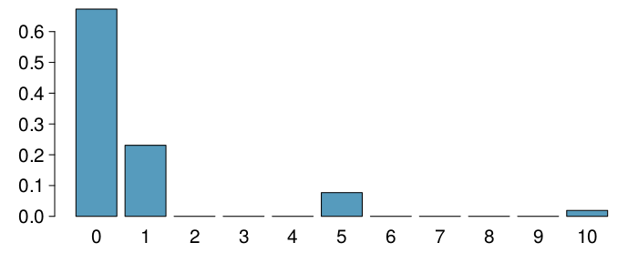

<style>
citation {
  font-size: 4px;
}
</style>


# Random variables

## Random variables

* A **random variable** is a numeric quantity whose value depends on the outcome of a random event
    - We use a capital letter, like $X$, to denote a random variable
    - The values of a random variable are denoted with a lowercase letter, in this case $x$
    - We write this as $P(X = x)$
 
## Random variables

* A **random variable** is a numeric quantity whose value depends on the outcome of a random event
    - We use a capital letter, like $X$, to denote a random variable
    - The values of a random variable are denoted with a lowercase letter, in this case $x$
    - We write this as $P(X = x)$
* There are two types of random variables:
    - **Discrete random variables** often take only integer values
        * **Example**: Number of credit hours, Difference in number of credit hours this term vs last
    - **Continuous random variables** take real (decimal) values
        * **Example**: Cost of books this term, Difference in cost of books this term vs last

## Expectation

* We are often interested in the average outcome of a random variable.
* We call this the **expected value**, or **mean**, and it is a weighted average of the possible outcomes
$$
\mu = \mathbf{E}(X) = \sum_{i = 1}^k x_i \cdot P(X = x_i)
$$

## Expected value of a discrete random variable

In a game of cards you win \$1 if you draw a heart, \$5 if you draw an ace (including the ace of hearts), \$10 if you draw the king of spades and nothing for any other card you draw. Write the probability model for your winnings, and calculate your expected winning.

Event		          $X$ 		          $P(X)$        	   $X ~ P(X)$ 
------            -----             -----------------  ----------------
Heart (not ace)	  $1$		            12/52              12/52          
Ace			          $5$	          	  4/52               20/52             	
King of spades	  $10$		          1/52               10/52           
All else		      $0$		            35/52              0

## Expected value of a discrete random variable

Event		          $X$ 		          $P(X)$        	   $X ~ P(X)$ 
------            -----             -----------------  ----------------
Heart (not ace)	  $1$		            12/52              12/52          
Ace			          $5$	          	  4/52               20/52             	
King of spades	  $10$		          1/52               10/52           
All else		      $0$		            35/52              0
Total                                                  $E[X] = 42/52 \approx 0.81$

## Expected value of a discrete random variable (cont.)

Below is a visual representation of the probability distribution of winnings from this game:

<center>
```{r, out.width = "700px", echo = FALSE}

```
</center>

## Variability in random variables

We are also often interested in the variability in the values of a random variable.

$$
\sigma^2 = \mathbf{Var}(X) = \sum_{i = 1}^k \left(x_i - E(X)\right)^2 \cdot P(X = x_i)\\
\;\\
\sigma = SD(X) = \sqrt{Var(X)}
$$

## Variability of a discrete random variable

**For the previous card game example, how much would you expect the winnings to vary from game to game?**

$X$       $P(X)$       $X~P(X)$            $(X-E[X])^2$             $P(X)\cdot (X-E[X])^2$
-----     ----------   ------------------  ----------------------   --------------------------
1         12/52        1 x 12/52 = 12/52   $(1-0.81)^2 = 0.0361     12/52 x 0.0361 = 0.0083
5         4/52         5 x 4/52 = 20/52    $(5-0.81)^2 = 17.5561    4/52 x 17.5561 = 1.3505
10        1/52         10 x 1/52 = 10/52   $(10-0.81)^2 = 84.4561   1/52 x 84.0889 = 1.6242
0         35/52        0 x 35/52 = 0       $(0-0.81)^2 = 0.6561     35/52 x 0.6561 = 0.4416
                       $E[X] = 0.81$
                       
## Variability of a discrete random variable

**For the previous card game example, how much would you expect the winnings to vary from game to game?**

$X$       $P(X)$       $X~P(X)$            $(X-E[X])^2$             $P(X)\cdot (X-E[X])^2$
-----     ----------   ------------------  ----------------------   --------------------------
1         12/52        1 x 12/52 = 12/52   $(1-0.81)^2 = 0.0361     12/52 x 0.0361 = 0.0083
5         4/52         5 x 4/52 = 20/52    $(5-0.81)^2 = 17.5561    4/52 x 17.5561 = 1.3505
10        1/52         10 x 1/52 = 10/52   $(10-0.81)^2 = 84.4561   1/52 x 84.0889 = 1.6242
0         35/52        0 x 35/52 = 0       $(0-0.81)^2 = 0.6561     35/52 x 0.6561 = 0.4416
                       $E[X] = 0.81$                                $V[X] = 3.4246$
                                                                    $SD(X) = \sqrt{3.4246} = 1.85$
                                                                    

## Variability: the R way

We could also do all of this in R, and it's easier: no tracking decimals, no computations!
```{r}
x <- c(1, 5, 10, 0)
pX <- c(12/52, 4/52, 1/52, 35/52)
var <- pX * (x - sum(x * pX))^2
var
sum(var)
```

## Linear combinations of random variables

* A **linear combination** of random variables $X$ and $Y$ is given by
$$
aX + bY 
$$
where $a$ and $b$ are some fixed numbers.

## Linear combinations of random variables

* A **linear combination** of random variables $X$ and $Y$ is given by
$$
aX + bY 
$$
where $a$ and $b$ are some fixed numbers.
* The average value of a linear combination of random variables is given by
$$
E(aX + bY) = a \times E(X) + b \times E(Y)
$$

## Calculating the expectation of a linear combination

On average you take 10 minutes for each statistics homework problem and 15 minutes for each chemistry homework problem. This week you have 5 statistics and 4 chemistry homework problems assigned. What is the total time you expect to spend on statistics and physics homework for the week?

## Calculating the expectation of a linear combination

On average you take 10 minutes for each statistics homework problem and 15 minutes for each chemistry homework problem. This week you have 5 statistics and 4 chemistry homework problems assigned. What is the total time you expect to spend on statistics and physics homework for the week?

$$
\begin{split}
E(S + S + S + S + S + C + C + C + C) &= 5 \times E(S) + 4 \times E(C) \\
&= 5 \times 10 + 4 \times 15 \\
&= 50 + 60 \\
&= 110~\text{min }
\end{split}
$$

## Variability in linear combinations of random variables

* The variability of a linear combination of two independent random variables is calculated as
$$
V(aX + bY) = a^2 \times V(X) + b^2 \times V(Y)
$$
* The standard deviation of the linear combination is the square root of the variance.

**If the random variables are not independent, the variance calculation gets a little more complicated and is beyond the scope of this course.**

## Calculating the variance of a linear combination

The standard deviation of the time you take for each statistics homework problem is 1.5 minutes, and it is 2 minutes for each chemistry problem. What is the standard deviation of the time you expect to spend on statistics and physics homework for the week if you have 5 statistics and 4 chemistry homework problems assigned? Suppose that the time it takes to complete each problem is independent of another.

## Calculating the variance of a linear combination

The standard deviation of the time you take for each statistics homework problem is 1.5 minutes, and it is 2 minutes for each chemistry problem. What is the standard deviation of the time you expect to spend on statistics and physics homework for the week if you have 5 statistics and 4 chemistry homework problems assigned? Suppose that the time it takes to complete each problem is independent of another.

$$
\begin{split}
V(S+S+S+S+S+C+C+C) &= V(S) + V(S) + V(S) + V(S) + \\ &\phantom{==}V(S) + V(C) + V(C) + V(C) + V(C) \\
&= 5 \times V(S) + 4 \times V(C) \\
&= 5 \times 1.5^2 + 4 \times 2^2 \\
&= 27.25
\end{split}
$$

## Calculating Variance: the R way

```{r}
5 * 1.5^2 + 4 * 2^2
```

## Practice

A casino game costs \$5 to play. If the first card you draw is red, then you get to draw a second card (without replacement). If the second card is the ace of clubs, you win \$500. If not, you don't win anything, i.e. lose your \$5. What is your expected profits/losses from playing this game? **<span style="font-size:16px;">Remember: profit/loss = winnings - cost.</span>**

* A profit of 5 cents
* A loss of 10 cents
* A loss of 25 cents
* A loss of 30 cents

## Practice

A casino game costs \$5 to play. If the first card you draw is red, then you get to draw a second card (without replacement). If the second card is the ace of clubs, you win \$500. If not, you don't win anything, i.e. lose your \$5. What is your expected profits/losses from playing this game? **<span style="font-size:16px;">Remember: profit/loss = winnings - cost.</span>**

$$
\text{A profit of 5 cents}\qquad \text{A loss of 25 cents}\\
\text{A loss of 10 cents} \qquad \text{A loss of 30 cents}
$$

Event                     Win             Profit:$~X$              $P(X)$                                        $X\cdot P(X)$
--------                  -----------     --------------------     ------------------------------------------    -------------------
**Red**, A{$\clubsuit$}   500             $500 - 5 = 495$          $\frac{26}{52} \cdot\frac{1}{51} = 0.0098$    $495 \times 0.0098 = 4.851$ 
Other                     0               $0 - 5 = -5$             $1 - 0.0098 = 0.9902$                         $-5 \times 0.9902 = -4.951$ 
                                                                                                                 $E(X) = -0.1$

## Fair game

A **fair** game is defined as a game that costs as much as its expected payout, i.e., expected profit is 0.

## Fair game

A **fair** game is defined as a game that costs as much as its expected payout, i.e., expected profit is 0.

**Do you think casino games in Vegas cost more or less than their expected payouts?**

<div style= "float:right;position: relative; left: 10px; top: -20px;">
<center>
```{r, out.width = "400px", echo = FALSE}
knitr::include_graphics("fig/bellagio.jpg")
```
</center>
</div>
If those games cost less than their expected payouts, it would mean that the casinos would be losing money on average, and hence they wouldn't be able to pay for all this:

<!--<span id="footnote">Image by Moyan_Brenn on Flickr http://www.flickr.com/photos/aigle_dore/5951714693</span>-->

## Simplifying random variables

Random variables do not work like normal algebraic variables:
$$
X + X \ne 2X
$$

## Simplifying random variables

Random variables do not work like normal algebraic variables:
$$
X + X \ne 2X
$$

$$
\begin{align*}
E(X + X) &= E(X) + E(X) \\
&= 2 E(X) \\
&~  \\
E(2X) &= 2 E(X) \\
&~ 
\end{align*}
$$

## Simplifying random variables (cont.)
$$
\begin{align*}
Var(X + X) &= Var(X) + Var(X)~{\scriptsize \text{(assuming independence)}} \\
&= 2~Var(X) \\
&~  \\
Var(2X) &= 2^2~Var(X) \\
&= 4~Var(X)
\end{align*}
$$

**So**:
$$
E(X + X)  = E(2X), \text{ but }  Var(X + X) \ne Var(2X)
$$

## Adding or multiplying?

A company has 5 Lincoln Town Cars in its fleet. Historical data show that annual maintenance cost for each car is on average \$2,154 with a standard deviation of \$132. What is the mean and the standard deviation of the total annual maintenance cost for this fleet?

Note that we have 5 cars each with the given annual maintenance cost $(X_1 + X_2 + X_3 + X_4 + X_5)$, not one car that had 5 times the given annual maintenance cost $(5X)$.

## Adding or multiplying?

$$
\begin{split}
E(X_1 + X_2 + X_3 + X_4 + X_5) &=& E(X_1) + E(X_2) + \cdots + E(X_5) \\
&=& 5 \times E(X) = 5 \times 2,154 = \$ 10,770 \\
Var(X_1 + X_2 + X_3 + X_4 + X_5) &=& Var(X_1) + Var(X_2) + \cdots + Var(X_5) \\
&=& 5 \times V(X) = 5 \times 132^2 = \$ 87,120 \\
SD(X_1 + X_2 + X_3 + X_4 + X_5) &=& \sqrt{87,120} =  295.16
\end{split}
$$

## What's the Point?

What's the point of all this?

Well ... for the rest of the semester, the "thing" we will be looking at in almost all
problems will be a random variable. So we need you to comprehend that random variables
have properties (like expectation, and variance, and distributions), and that knowing
those properties gives you power. 

There won't be many questions on this topic, which is why I've placed it in a Friday slot. 

We will resume on Monday/Tuesday with our first distribution families!