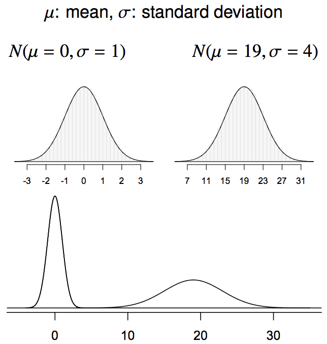

<style>
citation {
  font-size: 4px;
}
</style>

# The Binomial Distribution

## Binomial Distribution

A **very** important discrete distribution is the **binomial distribution**, which results when we have:
  
  * a **fixed** number of trials $n$
  * only **two** outcomes possible in each trial
* each trial is **independent**
  * the probability of a **success** is the same

**Definition**: the binomial distribution counts the number of successes in $n$ independent trials
of an experiment with fixed probability of success $p$
  
## Binomial Notation
  
  * $n$ - the fixed number of trials/experiments
* $x$ - a specific number of successes we are interested in (must be between $0$ and $n$, obviously)
* $p$ - probability of success in any one trial/experiment
* $P(X)$ - the probability of getting exactly $x$ successes in $n$ trials

## The Binomial Probability Formula

$$
  P(x) = \frac{n!}{(n-x)!x!} \cdot p^x \cdot (1-p)^{n-x}
$$
  
  Note that this probability formula is for **one specific value of $x$**. So if you are asked something involving multiple cases of
$x$, you have to do multiple computations!
  
  **We will use R to compute these, as they are very, very tedious by hand.**

## R Syntax for Computing Things with Binomials

**Example:**
```{r}
pbinom(q = 6, size = 10, prob = 0.5, lower.tail = TRUE)
```
This gives the probability of getting **six or less correct**
answers in ten trials, again with a 50/50 probability (like Example 1).

## R Syntax for Computing Things with Binomials

**Example:**
```{r}
pbinom(q = 6, size = 10, prob = 0.5, lower.tail = FALSE)
```
This gives the probability of getting **MORE THAN SIX correct**
answers in ten trials, again with a 50/50 probability (like Example 1).

**Note**: this is **not** "greater than or equal to", it is strictly
**greater than**. That is, if **q = 6**, this means {7, 8, 9, 10},
**not** {6, 7, 8, 9, 10}.

## General R Syntax

```{r, eval = FALSE}
pbinom(q = max or min number of successes,
       size = total number of trials,
       prob = probability of success,
       lower.tail = TRUE for q being max, FALSE for q being min)

dbinom(x = number of successes interested in,
       size = total number of trials,
       prob = probability of success)
```

# Normal Distribution

## The Normal Distribution
* Unimodal and symmetric, bell shaped curve
* Many variables are nearly normal, but none are exactly normal
* Denoted as $\mathcal{N}(\mu, \sigma) \rightarrow$ Normal with mean $\mu$ and standard deviation $\sigma$

<div style= "float:center; position: relative; top: -25px; left:150px;">
```{r, echo=FALSE, out.width = "550px"}
plot(x = seq(-4, 4, 0.01), y = dnorm(seq(-4, 4, 0.01)), xlab = "", ylab = "", type = "l", yaxt = 'n', xaxt = 'n')
```
</div>

## Normal distributions with different parameters

<div style= "float:center; position: relative; top:-20px; left:200px;">
```{r, echo=FALSE, out.width = "500px"}

```
</div>

***
SAT scores are distributed nearly normally with mean 1500 and standard deviation 300. ACT scores are distributed nearly normally with mean 21 and standard deviation 5. A college admissions officer wants to determine which of the two applicants scored better on their standardized test with respect to the other test takers: Pam, who earned an 1800 on her SAT, or Jim, who scored a 24 on his ACT?

<div style= "float:center; position: relative; top:20px; left:200px;">
```{r, echo=FALSE, out.width = "600px"}
knitr::include_graphics("fig/fig_2_6_pam_jim.png")
```
</div>

## Standardizing with Z-scores

Since we cannot just compare these two raw scores, we instead compare how many standard deviations beyond the mean each observation is.

* Pam's score is $(1800 - 1500) / 300 = 1$ standard deviation above the mean.
* Jim's score is $(24 - 21) / 5 = 0.6$ standard deviations above the mean.

<div style= "float:center; position: relative; top:20px; left:200px;">
```{r, echo=FALSE, out.width = "550px"}
knitr::include_graphics("fig/fig_2_6_pam_jim2.png")
```
</div>

## Standardizing with Z-scores (continued)

These are called **standardized scores**, or **Z-scores** (or **Z scores**).

* Z score of an observation is the number of standard deviations it falls above or below the mean.
$$
Z = (\text{observation} - \text{mean}) / \text{SD}
$$
* Z scores are defined for distributions of any shape, but only when the distribution is normal can we use Z scores to calculate percentiles.
* Observations that are more than 2 SD away from the mean ($|Z| > 2$) are usually considered unusual.

## Percentiles

* **Percentile** is the percentage of observations that fall below a given data point
* Graphically, percentile is the area below the probability distribution curve to the left of that observation

<div style= "float:center; position: relative; top:20px; left:200px;">
```{r, echo=FALSE, out.width = "550px"}
knitr::include_graphics("fig/fig_2_6_percentile.png")
```
</div>

## Calculating Percentiles using Computation
There are many ways to compute percentiles/areas under the curve.

**R**:
```{r}
pnorm(1800, mean = 1500, sd = 300)
```

# Examples

## Binomial Example 1

The probability that a patient recovers from a particular stomach
disease is 0.8. Suppose 20 people are known to have contracted
this disease. What is the probability that:

* exactly 14 recover?
* at least 10 recover?
* at least 14, but no more than 18, recover?
* at most 16 recover?

## Binomial Example 2

A fire-detection device utilizes three temperature-sensitive
cells acting independently of each other in such a manner
that any one or more may activate the alarm. Each cell 
possesses a probability of $p = 0.7$ of activating the
alarm when the temperature reaches $100^\circ$ Celsius or more.
Let $Y$ equal the number of cells activating the alarm
when the temperature reaches $100^\circ$. 

* Find the probability distribution for $Y$
* Find the probability that the alarm will function correctly
when the temperature reaches $100^\circ$

## Binomial Example 3

The taste test for phenylthiocarbamide is a favourite exercise
in beginning human genetics classes. It has been established
that a single gene determines whether or not an individual
is a "taster". If 70\% of Canadians are "tasters", and 20 
Americans are randomly selected, what is the probability that

* at least 17 are "tasters"?
* fewer than 15 are "tasters"?

## Normal Example 1

Use R to find the following probabilities for a standard normal
random variable $Z$:

* $P[0 \leq Z \leq 1.2]$
* $P[-0.9 \leq Z \leq 0]$
* $P[0.3 \leq Z \leq 1.56]$

## Normal Example 2

The weekly amount of money spent on maintenance and repairs by
a company was observed, over a long period of time, to be approximately
normally distributed with mean \$400 and standard deviation
\$20. If \$450 is budgeted for next week, what is the probability
that the actual costs will exceed the budgeted amount?

How much should be budgeted for weekly repairs and maintenance
to provide that the probability the budgeted amount will be
exceeded in a given week is only 0.10?

## Normal Example 3

The grade point average of a large population of students
are approximately normally distributed with mean 2.4 and
standard deviation 0.8. What fraction of the students
will possess a GPA in excess of 3.0?

If students possessing a GPA of less than 1.9 are suspended
or expelled, what percentage of the students will be dropped?
