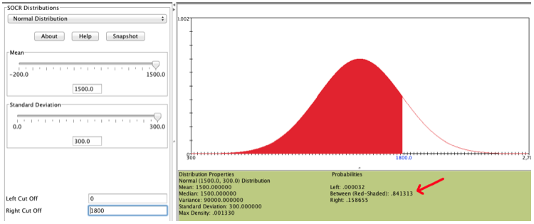
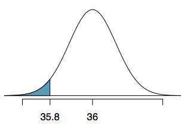
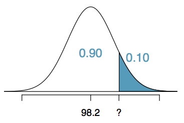
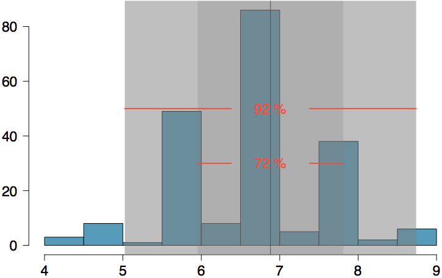

<style>
citation {
  font-size: 4px;
}
</style>

# The Binomial Distribution

## Binomial Distribution

A **very** important discrete distribution is the **binomial distribution**, which results when we have:
  
  * a **fixed** number of trials $n$
  * only **two** outcomes possible in each trial
* each trial is **independent**
  * the probability of a **success** is the same

**Definition**: the binomial distribution counts the number of successes in $n$ independent trials
of an experiment with fixed probability of success $p$
  
## Binomial Notation
  
  * $n$ - the fixed number of trials/experiments
* $x$ - a specific number of successes we are interested in (must be between $0$ and $n$, obviously)
* $p$ - probability of success in any one trial/experiment
* $P(X)$ - the probability of getting exactly $x$ successes in $n$ trials

## Things To Be Cautious Of

* make sure that $x$ and $p$ are referring to the same event
as success
* make sure that all trials/experiments are independent
* when sampling **without** replacement, make sure your total
number of trials/experiments is small when compared to population

## Example 1

Suppose you have no idea how to answer the questions on a True/False
test with 10 questions, and you decide to just flip a coin for each one. You then count how many questions you actually got correct. 

* $x =$ number of questions correct
* $n = 10$
  * $p = 0.5$ (fair coin?)
* trials are independent, since the coin flips have nothing to do with one another

In this situation, what is the probability of getting at least 6/10?
  
## Example 2
  
  According to Statistics Canada, as of the last census in 2016,
86.3% of Canadians between the ages of 25 and 64 have a completed
high school diploma, or equivalent. If we randomly select 15
Canadians aged 25-64, what is the probability distribution
of the number of sampled people who have completed a high school
diploma? 
  
  Find the probability that **at least 8 out of 15** randomly
selected Canadians aged 25-64 will have such a diploma.

## The Binomial Probability Formula

$$
  P(x) = \frac{n!}{(n-x)!x!} \cdot p^x \cdot (1-p)^{n-x}
$$
  
  Note that this probability formula is for **one specific value of $x$**. So if you are asked something involving multiple cases of
$x$, you have to do multiple computations!
  
  **We will use R to compute these, as they are very, very tedious by hand.**
  
## Example 2
  
  * $n = 15$
  * $p = 0.863$
  * $x \geq 8$
  
  Then:
  ```{r}
sum( dbinom(8:15, 15, 0.863) )
pbinom(q = 7, size = 15, prob = 0.863, lower.tail = FALSE)
```
(Note: we'll talk more about the $q=7$ in a couple of slides)

## R Syntax for Computing Things with Binomials

There are two functions we will use: **dbinom()** and 
**pbinom()**. The **d** stands for **distribution**, and 
corresponds to the formula back two slides.

**Example:**
```{r}
dbinom(x = 6, size = 10, prob = 0.5)
```
This gives the probability of **exactly six correct** answers in ten
trials with a 50/50 probability (Example 1).

## R Syntax for Computing Things with Binomials

**Example:**
```{r}
pbinom(q = 6, size = 10, prob = 0.5, lower.tail = TRUE)
```
This gives the probability of getting **six or less correct**
answers in ten trials, again with a 50/50 probability (like Example 1).

## R Syntax for Computing Things with Binomials

**Example:**
```{r}
pbinom(q = 6, size = 10, prob = 0.5, lower.tail = FALSE)
```
This gives the probability of getting **MORE THAN SIX correct**
answers in ten trials, again with a 50/50 probability (like Example 1).

**Note**: this is **not** "greater than or equal to", it is strictly
**greater than**. That is, if **q = 6**, this means {7, 8, 9, 10},
**not** {6, 7, 8, 9, 10}.

## General R Syntax

```{r, eval = FALSE}
pbinom(q = max or min number of successes,
       size = total number of trials,
       prob = probability of success,
       lower.tail = TRUE for q being max, FALSE for q being min)

dbinom(x = number of successes interested in,
       size = total number of trials,
       prob = probability of success)
```

# Continuous Distributions

## Continuous distributions

* Below is a histogram of the distribution of heights of US adults. 
* The proportion of data that falls in the shaded bins gives the probability that a randomly sampled US adult is between 180 cm and 185 cm (about 5'11" to 6'1").

<center>
  ```{r, out.width = "600px", echo = FALSE}

```
</center>
  
## From histograms to continuous distributions
  
  Since height is a continuous numerical variable, its **probability density function** is a smooth curve.

<center>
  ```{r, out.width = "600px", echo = FALSE}

```
</center>
  
  
## Probabilities from continuous distributions
  
  Therefore, the probability that a randomly sampled US adult is between 180 cm and 185 cm can also be estimated as the shaded area under the curve.

<center>
  ```{r, out.width = "600px", echo = FALSE}
knitr::include_graphics("fig/fdicHeightContDistFilled.png")
```
</center>
  
## By definition...
  
  Since continuous probabilities are estimated as "the area under the curve", the probability of a person being exactly 180 cm (or any exact value) is defined as 0.

<center>
  ```{r, out.width = "600px", echo = FALSE}
knitr::include_graphics("fig/fdicHeightContDist180.png")
```
</center>
  

# Normal Distribution

## The Normal Distribution
* Unimodal and symmetric, bell shaped curve
* Many variables are nearly normal, but none are exactly normal
* Denoted as $\mathcal{N}(\mu, \sigma) \rightarrow$ Normal with mean $\mu$ and standard deviation $\sigma$

<div style= "float:center; position: relative; top: -25px; left:150px;">
```{r, echo=FALSE, out.width = "550px"}
plot(x = seq(-4, 4, 0.01), y = dnorm(seq(-4, 4, 0.01)), xlab = "", ylab = "", type = "l", yaxt = 'n', xaxt = 'n')
```
</div>

## Heights of Males
<div style= "float:left; position: relative; top:-20px; right:10px;">
```{r, echo=FALSE, out.width = "400px"}
knitr::include_graphics("fig/fig_2_6_okcupid.png")
```
</div>

“The male heights on OkCupid very nearly follow the expected normal distribution -- except the whole thing is shifted to the right of where it should be. Almost universally guys like to add a couple inches.”

“You can also see a more subtle vanity at work: starting at roughly 5'8", the top of the dotted curve tilts even further rightward. This means that guys as they get closer to six feet round up a bit more than usual, stretching for that coveted psychological benchmark.”

<div id="footnote">http://blog.okcupid.com/index.php/the-biggest-lies-in-online-dating</div>

## Heights of Females
<div style= "float:left; position: relative; top:-20px; right:10px;">
```{r, echo=FALSE, out.width = "400px"}
knitr::include_graphics("fig/fig_2_6_okcupid2.png")
```
</div>
“When we looked into the data for women, we were surprised to see height exaggeration was just as widespread, though without the lurch towards a benchmark height.”

<div id="footnote">http://blog.okcupid.com/index.php/the-biggest-lies-in-online-dating</div>

## Normal distributions with different parameters

<div style= "float:center; position: relative; top:-20px; left:200px;">
```{r, echo=FALSE, out.width = "500px"}
knitr::include_graphics("fig/fig_2_6_mu_sd.png")
```
</div>

***
SAT scores are distributed nearly normally with mean 1500 and standard deviation 300. ACT scores are distributed nearly normally with mean 21 and standard deviation 5. A college admissions officer wants to determine which of the two applicants scored better on their standardized test with respect to the other test takers: Pam, who earned an 1800 on her SAT, or Jim, who scored a 24 on his ACT?

<div style= "float:center; position: relative; top:20px; left:200px;">
```{r, echo=FALSE, out.width = "600px"}
knitr::include_graphics("fig/fig_2_6_pam_jim.png")
```
</div>

## Standardizing with Z-scores

Since we cannot just compare these two raw scores, we instead compare how many standard deviations beyond the mean each observation is.

* Pam's score is $(1800 - 1500) / 300 = 1$ standard deviation above the mean.
* Jim's score is $(24 - 21) / 5 = 0.6$ standard deviations above the mean.

<div style= "float:center; position: relative; top:20px; left:200px;">
```{r, echo=FALSE, out.width = "550px"}
knitr::include_graphics("fig/fig_2_6_pam_jim2.png")
```
</div>

## Standardizing with Z-scores (continued)

These are called **standardized scores**, or **Z-scores** (or **Z scores**).

* Z score of an observation is the number of standard deviations it falls above or below the mean.
$$
Z = (\text{observation} - \text{mean}) / \text{SD}
$$
* Z scores are defined for distributions of any shape, but only when the distribution is normal can we use Z scores to calculate percentiles.
* Observations that are more than 2 SD away from the mean ($|Z| > 2$) are usually considered unusual.

## Percentiles

* **Percentile** is the percentage of observations that fall below a given data point
* Graphically, percentile is the area below the probability distribution curve to the left of that observation

<div style= "float:center; position: relative; top:20px; left:200px;">
```{r, echo=FALSE, out.width = "550px"}
knitr::include_graphics("fig/fig_2_6_percentile.png")
```
</div>

## Calculating Percentiles using Computation
There are many ways to compute percentiles/areas under the curve.

**R**:
```{r}
pnorm(1800, mean = 1500, sd = 300)
```

**Applets**:
<div style= "float:center; position: relative; top:-20px; left:200px;">
```{r, echo=FALSE, out.width = "500px"}

```
</div>

## Example: Quality Control

At the Heinz ketchup factory, the amounts which go into bottles of ketchup are supposed to be normally distributed with mean 36 oz. and standard deviation 0.11 oz. Once every 30 minutes a bottle is selected from the production line, and its contents are noted precisely. If the amount of ketchup in the bottle is below 35.8 oz. or above 36.2 oz., then the bottle fails the quality control inspection. What percent of bottles have less than 35.8 ounces of ketchup?

* Let $X$ = amount of ketchup in a bottle: $X \sim \mathcal{N}(\mu = 36, \sigma = 0.11)$

<div style= "float:left; position: relative; top:-10px; right:25px;">
```{r, echo=FALSE, out.width = "350px"}
knitr::include_graphics("fig/fig_2_6_qc.png")
```
</div>
$$
Z = \frac{35.8 - 36}{0.11} = -1.82
$$

## Finding the exact probability - using R

```{r}
pnorm(q = -1.82, lower.tail = TRUE)
```

Simple!

## Practice

What percentage of bottles **pass** the quality control inspection?

1. 1.82%   &nbsp; &nbsp; &nbsp; 4. 93.12%
2. 3.44%   &nbsp; &nbsp; &nbsp; 5. 95.56%
3. 6.88%

## Practice

What percentage of bottles **pass** the quality control inspection?

1. 1.82%   &nbsp; &nbsp; &nbsp; 4.<div id="highlight"> 93.12%</div>
2. 3.44%   &nbsp; &nbsp; &nbsp; 5. 95.56%
3. 6.88%

<div style="float:left; position:relative; left:100px;">
```{r, echo=FALSE, out.width = "200px"}
knitr::include_graphics("fig/fig_2_6_normal1.png")
```
</div>
<div style="float:left; position:relative; top:-10px; left:100px;">
```{r, echo=FALSE, out.width = "200px"}
knitr::include_graphics("fig/fig_2_6_normal2.png")
```
</div>
<div style="float:left; position:relative; top:-20px; left:120px;">
```{r, echo=FALSE, out.width = "200px"}

```
</div>

<br />

<div style="font-size:18px; top:-50px;">
$$
\begin{split}
Z_{35.8} &= \frac{35.8 - 36}{0.11} = -1.82 \\
Z_{36.2} &= \frac{36.2 - 36}{0.11} = 1.82 \\
P(35.8 < X < 36.2) &= P(-1.82 < Z < 1.82) = 0.9656 - 0.0344 = 0.9312 = 93.12\%
\end{split}
$$
</div>

## Example: Finding Cutoff Points
Body temperatures of healthy humans are distributed nearly normally with mean 98.2$^\circ$F and standard deviation 0.73$^\circ$F. What is the cutoff for the lowest 3% of human body temperatures?

<div style="float:left; position:relative; top:-20px; left:50px;">
```{r, echo=FALSE, out.width = "250px"}
knitr::include_graphics("fig/fig_2_6_normal4.png")
```
</div>

<br />

<div style="font-size:18px; top:-50px;">
$$
\begin{split}
P(X < x) &= 0.03 \longrightarrow P(Z < -1.88) = 0.03 \\
Z &= \frac{\text{obs} - \text{mean}}{\text{SD}} \longrightarrow \frac{x - 98.2}{0.73} = -1.88 \\
x &= (-1.88 \times 0.73) + 98.2 = 96.8^\circ\text{F}
\end{split}
$$
</div>

<br/>

**Note**: taking $P(Z < z_0) = 0.03$ and determining that the value 
is $-1.88$ required R - we'll discuss the exact mechanism in
the lecture on Friday, Lecture #09.

<div id="footnote">Mackowiak, Wasserman, and Levine (1992), A Critical Appraisal of 98.6 Degrees F, the Upper Limit of the Normal Body Temperature, and Other Legacies of Carl Reinhold August Wunderlick.</div>

## Practice

Body temperatures of healthy humans are distributed nearly normally with mean 98.2$^\circ$F and standard deviation 0.73$^\circ$F. What is the cutoff for the highest 10% of human body temperatures?

1. 97.3$^\circ$F &nbsp; &nbsp; &nbsp; 3. 99.4$^\circ$F
2. 99.1$^\circ$F &nbsp; &nbsp; &nbsp; 4. 99.6$^\circ$F

## Practice
Body temperatures of healthy humans are distributed nearly normally with mean 98.2$^\circ$F and standard deviation 0.73$^\circ$F. What is the cutoff for the highest 10% of human body temperatures?

1. 97.3$^\circ$F &nbsp; &nbsp; &nbsp; 3. 99.4$^\circ$F
2. <span id="highlight">99.1$^\circ$F</span> &nbsp; &nbsp; &nbsp; 4. 99.6$^\circ$F

<div style="float:left; position:relative; top:-20px; left:50px;">
```{r, echo=FALSE, out.width = "250px"}

```
</div>


<div style="font-size:18px; ">
$$
\begin{split}
P(X > x) &= 0.10 \longrightarrow P(Z > 1.28) = 0.10 \\
Z &= \frac{\text{obs} - \text{mean}}{\text{SD}} \longrightarrow \frac{x - 98.2}{0.73} = 1.28 \\
x &= (1.28 \times 0.73) + 98.2 = 99.1^\circ\text{F}
\end{split}
$$
</div>

## 68-95-99.7 Rule

For normally distributed data,

* about 68% falls within 1 SD of the mean
* about 95% falls within 2 SD of the mean
* about 99.7% falls within 3 SD of the mean

It is possible for observations to fall 4, 5 or even more standard deviations away from the mean, but these occurrences are very rare if the data are nearly normal.

<div style="float:left; position:relative; top:-20px; left:250px;">
```{r, echo=FALSE, out.width = "400px"}
knitr::include_graphics("fig/fig_2_6_sd_rule.png")
```
</div>

## Describing variability using the 68-95-99.7 Rule

<div style="font-size:22px;">
SAT scores are distributed nearly normally, with mean 1500 and standard deviation 300. 

* $\approx$ 68% of students score between 1200 and 1800 on the SAT
* $\approx$ 95% of students score between 900 and 2100 on the SAT
* $\approx$ 99.7% of students score between 600 and 2400 on the SAT
</div>

<div style="float:left; position:relative; top:-10px; left:250px;">
```{r, echo=FALSE, out.width = "375px"}
knitr::include_graphics("fig/fig_2_6_sd_rule_specific.png")
```
</div>

<div id="footnote">Note that it is not possible to achieve more than 2400 points on the SAT. In 2015, 1.7 million students took the SAT, with an average score of 1490 and less than 8500 students scoring higher than 2280.</div>

## Example: Number of nights of sleep on school nights

<div style="float:left; position:relative; top:-10px; left:200px;">
```{r, echo=FALSE, out.width = "500px"}
knitr::include_graphics("fig/fig_2_6_hist.png")
```
</div>

## Example: Number of nights of sleep on school nights

<div style="width:100%; float:left; position:relative; top:-10px; left:200px;">
```{r, echo=FALSE, out.width = "500px"}
knitr::include_graphics("fig/fig_2_6_hist2.png")
```
</div>

<div style="font-size:22px;">
Mean = 6.88 hours, SD = 0.92 hours.  <br />
72% of the data are within 1 SD of the mean: 6.88 $\pm$ 0.93.
</div>

## Example: Number of nights of sleep on school nights

<div style="width:100%; float:left; position:relative; top:-10px; left:200px;">
```{r, echo=FALSE, out.width = "500px"}

```
</div>

<div style="font-size:22px;">
Mean = 6.88 hours, SD = 0.92 hours. <br />
72% of the data are within 1 SD of the mean: 6.88 $\pm$ 0.93.<br />
92% of the data are within 2 SD of the mean: 6.88 $\pm$ 2 $\times$ 0.93.
</div>

## Example: Number of nights of sleep on school nights

<div style="width:100%; float:left; position:relative; top:-10px; left:200px;">
```{r, echo=FALSE, out.width = "500px"}
knitr::include_graphics("fig/fig_2_6_hist4.png")
```
</div>

<div style="font-size:22px;">
Mean = 6.88 hours, SD = 0.92 hours. <br />
72% of the data are within 1 SD of the mean: 6.88 $\pm$ 0.93.<br />
92% of the data are within 2 SD of the mean: 6.88 $\pm$ 2 $\times$ 0.93. <br />
99% of the data are within 3 SD of the mean: 6.88 $\pm$ 3 $\times$ 0.93. 
</div>

## Practice

Which of the following is **false**?

1. Majority of Z scores in a right skewed distribution are negative.
2. In a skewed distributions the Z score of the mean might be different than 0.
3. For a normal distribution, IQR is less than 2 x SD.
4. Z scores are helpful for determining how unusual a data point is compared to the rest of the data in the distribution.

## Practice

Which of the following is **false**?

1. Majority of Z scores in a right skewed distribution are negative.
2. In a skewed distributions the Z score of the mean might be different than 0.
3. <span id="highlight">For a normal distribution, the IQR is less than 2 x SD.</span>
4. Z scores are helpful for determining how unusual a data point is compared to the rest of the data in the distribution.

# The Normal Approximation

## Evaluating The Normal Approximation

We often use the normal distribution as an **approximation**, 
taking real data and assuming it follows the normal.

<br>
How do we tell whether this is a good assumption?

## Normal probability plot (QQ)

A histogram and **normal probability plot** of a sample of 100 male heights.

<center>
```{r, out.width = "700px", echo = FALSE}
knitr::include_graphics("fig/fcidMHeights.png")
```
</center>

<br>
The right hand plot is also called a **quantile-quantile plot**, or **QQ plot** for short.

## Anatomy of a normal probability plot

* Data are plotted on the y-axis of a normal probability plot, and theoretical quantiles (following a normal distribution) on the x-axis.
* If there is a linear relationship in the plot, then the data follow a nearly normal distribution.
*  Constructing a normal probability plot requires calculating percentiles and corresponding z-scores for each observation, which is tedious. Therefore we generally rely on R when making these plots.

## NBA Heights, 2008-09

Below is a histogram and normal probability plot for the NBA heights from the 2008-2009 season. Do these data appear to follow a normal distribution?

<center>
```{r, out.width = "700px", echo = FALSE}
knitr::include_graphics("fig/nbaNormal.png")
```
</center>

## NBA Heights, 2008-09

Below is a histogram and normal probability plot for the NBA heights from the 2008-2009 season. Do these data appear to follow a normal distribution?

<center>
```{r, out.width = "700px", echo = FALSE}
knitr::include_graphics("fig/nbaNormal.png")
```
</center>

<br>
**Why do the points on the normal probability have jumps?**

## Normal probability plot and skewness

<center>
**Left Skew** <br/>
```{r, out.width = "400px", echo = FALSE}

```
</center>

## Normal probability plot and skewness

<center>
**Right Skew** <br/>
```{r, out.width = "400px", echo = FALSE}
knitr::include_graphics("fig/qq_rs.png")
```
</center>

## Normal probability plot and skewness

<center>
**Long Tails** <br/>
```{r, out.width = "400px", echo = FALSE}

```
</center>

## Normal probability plot and skewness

<center>
**Short Tails** <br/>
```{r, out.width = "400px", echo = FALSE}
knitr::include_graphics("fig/qq_st.png")
```
</center>
