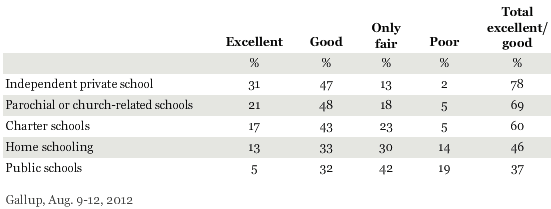
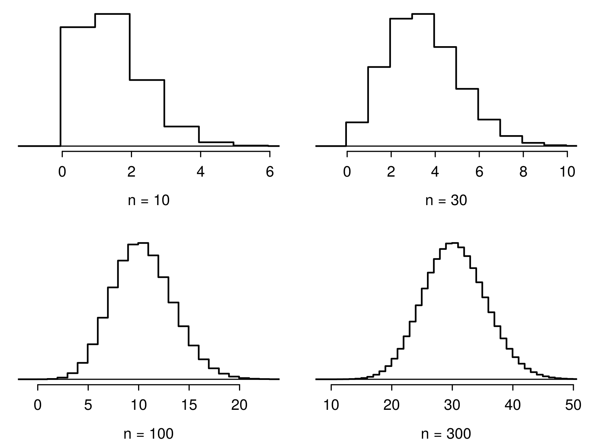
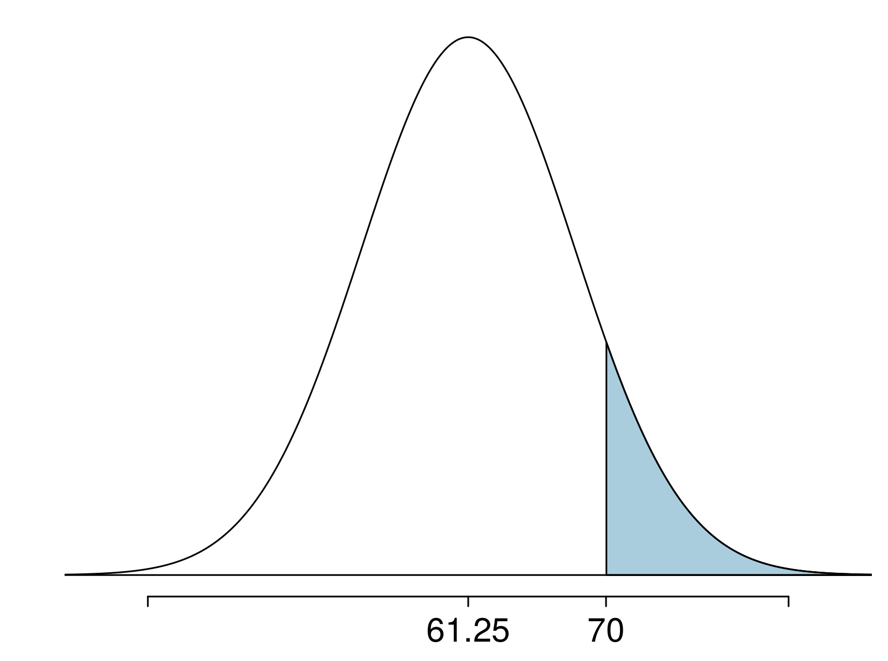

<style>
citation {
  font-size: 4px;
}
</style>


# Binomial Distribution (again)

## The Binomial Distribution


## Gallup Poll: Obesity in America

A 2012 Gallup survey suggests that 26.2% of Americans are obese. Among a random sample of 10 Americans, what is the probability that exactly 8 are obese?

* pretty high?
* pretty low?

<div id="footnote">Gallup: http://www.gallup.com/poll/160061/obesity-rate-stable-2012.aspx , January 23, 2013.</div>

## Gallup Poll: Obesity in America

A 2012 Gallup survey suggests that 26.2% of Americans are obese. Among a random sample of 10 Americans, what is the probability that exactly 8 are obese?

* $0.262^8 \times 0.738^2$
* ${8 \choose 10} \times 0.262^8 \times 0.738^2$
* ${10 \choose 8} \times 0.262^8 \times 0.738^2$
* ${10 \choose 8} \times 0.262^2 \times 0.738^8$

## Gallup Poll: Obesity in America

A 2012 Gallup survey suggests that 26.2% of Americans are obese. Among a random sample of 10 Americans, what is the probability that exactly 8 are obese?

* $0.262^8 \times 0.738^2$
* ${8 \choose 10} \times 0.262^8 \times 0.738^2$
* **${10 \choose 8} \times 0.262^8 \times 0.738^2 = 45 \times  0.262^8 \times 0.738^2 = 0.0005$**
* ${10 \choose 8} \times 0.262^2 \times 0.738^8$

## Expected value

A 2012 Gallup survey suggests that 26.2% of Americans are obese.

Among a random sample of 100 Americans, how many would you expect to be obese?

## Expected value

A 2012 Gallup survey suggests that 26.2% of Americans are obese.

Among a random sample of 100 Americans, how many would you expect to be obese?

* Easy enough, $100 \times 0.262 = 26.2$.
* Or more formally, $\mu = np = 100 \times 0.262 = 26.2$.
* But this doesn't mean in every random sample of 100 people exactly 26.2 will be obese. In fact, that's not even possible. In some samples this value will be less, and in others more. How much would we expect this value to vary?

## Expected value and its variability

Mean and standard deviation of binomial distribution
$$
\mu = np \qquad \qquad \sigma = \sqrt{np(1-p)}
$$

* Going back to the obesity rate:
$$
\sigma = \sqrt{np(1-p)} = \sqrt{100 \times 0.262 \times 0.738} \approx  4.4
$$
* We would expect 26.2 out of 100 randomly sampled Americans to be obese, with a standard deviation of 4.4.


**Note:** Mean and standard deviation of a binomial might not always be whole numbers, and that is alright, these values represent what we would expect to see on average.

## Unusual observations

Using the notion that **observations that are more than 2 standard deviations away from the mean are considered unusual** and the mean and the standard deviation we just computed, we can calculate a range for the plausible number of obese Americans in random samples of 100.

$$
26.2 \pm (2 \times 4.4) = (17.4, 35)
$$

## Gallup Poll: Home Schooling

An August 2012 Gallup poll suggests that 13% of Americans think home schooling provides an excellent education for children.  Would a random sample of 1,000 Americans where only 100 share this opinion be considered unusual?

<div style= "float:left; position: relative; top:0px; right:10px;">
* Yes
* No
</div>
<div style="float:right; position: relative;">
```{r, out.width = "700px", echo = FALSE}

```
</div>

## Gallup Poll: Home Schooling

$$
\begin{align*}
\mu &= np = 1,000 \times 0.13 = 130 \\
\sigma &= \sqrt{np(1-p)} = \sqrt{1,000 \times 0.13 \times 0.87} \approx 10.6
\end{align*}
$$

* Method 1: Range of usual observations: $130 \pm 2 \times 10.6 = (108.8, 151.2)$ <br>
(100 is outside this range, so would be considered unusual)
* Method 2: Z-score of observation: $Z = \frac{x - mean}{SD} = \frac{100 - 130}{10.6} = -2.83$<br>
(100 is more than 2 SD below the mean, so would be considered unusual)

<div id="footnote">http://www.gallup.com/poll/156974/private-schools-top-marks-educating-children.aspx</div>

## Normal approximation to the binomial (Practice)

Go to https://gallery.shinyapps.io/dist_calc/ and choose Binomial coin experiment in the drop down menu on the left.

* Set the number of trials to 20 and the probability of success to 0.15. Describe the shape of the distribution of number of successes. 
* Keeping $p$ constant at 0.15, determine the minimum sample size required to obtain a unimodal and symmetric distribution of number of successes. Please submit only one response per team.
* Further considerations:
    - What happens to the shape of the distribution as $n$ stays constant and $p$ changes?
    - What happens to the shape of the distribution as $p$ stays constant and $n$ changes?

## Distributions of number of successes

Hollow histograms of samples from the binomial model where $p = 0.10$ and $n = 10$, $30$, $100$, and $300$. What happens as $n$ increases?

<center>
```{r, out.width = "400px", echo = FALSE}

```
</center>


## Low large is large enough?

The sample size is considered large enough if the expected number of successes and failures are both at least 10.
$$
np \ge 10 \qquad \text{ and } \qquad n(1-p) \ge 10
$$

## Practice

Below are four pairs of Binomial distribution parameters. Which distribution can be approximated by the normal distribution?

* $n = 100, p = 0.95$
* $n = 25, p = 0.45$ 
* $n = 150, p = 0.05$
* $n = 500, p = 0.015$

## Practice

Below are four pairs of Binomial distribution parameters. Which distribution can be approximated by the normal distribution?

* $n = 100, p = 0.95$
* **$n = 25, p = 0.45 \rightarrow 25 \times 0.45 = 11.25; 25 \times 0.55 = 13.75$**
* $n = 150, p = 0.05$
* $n = 500, p = 0.015$

## An analysis of Facebook users

A recent study found that "Facebook users get more than they give". For example:

* 40% of Facebook users in our sample made a friend request, but 63% received at least one request
* Users in our sample pressed the like button next to friends' content an average of 14 times, but had their content "liked" an average of 20 times
* Users sent 9 personal messages, but received 12
* 12% of users tagged a friend in a photo, but 35% were themselves tagged in a photo

Any guesses for how this pattern can be explained?

## An analysis of Facebook users

A recent study found that ``Facebook users get more than they give". For example:

* 40% of Facebook users in our sample made a friend request, but 63% received at least one request
* Users in our sample pressed the like button next to friends' content an average of 14 times, but had their content "liked" an average of 20 times
* Users sent 9 personal messages, but received 12
* 12% of users tagged a friend in a photo, but 35% were themselves tagged in a photo

Any guesses for how this pattern can be explained?

**Power users contribute much more content than the typical user.**

<div id="footnote">http://www.pewinternet.org/Reports/2012/Facebook-users/Summary.aspx</div>

## $\;$

This study also found that approximately 25% of Facebook users are considered power users. The same study found that the average Facebook user has 245 friends. What is the probability that the average Facebook user with 245 friends has 70 or more friends who would be considered power users? Note any assumptions you must make.

We are given that $n = 245, p = 0.25$, and we are asked for the probability $P(K \ge 70)$. To proceed, we need independence, which we'll assume but could check if we had access to more Facebook data.

## $\;$

We are given that $n = 245, p = 0.25$, and we are asked for the probability $P(K \ge 70)$. To proceed, we need independence, which we'll assume but could check if we had access to more Facebook data.

$$
\begin{align*}
P(X \ge 70) &= P(K = 70\text{ or }K = 71\text{ or }K = 72\text{ or }\cdots\text{ or } K = 245) \\
&= P(K = 70) + P(K = 71) + P(K = 72) + \cdots + P(K = 245)
\end{align*}
$$

This seems like an awful lot of work...

## Could Use R ...

```{r}
sum(dbinom(x = 70:245, size = 245, prob = 0.25))
pbinom(q = 69, size = 245, prob = 0.25, lower.tail = FALSE)
```

## Normal approximation to the binomial

When the sample size is large enough, the binomial distribution with parameters $n$ and $p$ can be approximated by the normal model with parameters $\mu = np$ and $\sigma = \sqrt{np(1-p)}$.

* In the case of the Facebook power users, $n = 245$ and $p = 0.25$.
$$
\mu = 245 \times 0.25 = 61.25 \qquad \sigma = \sqrt{245 \times 0.25 \times 0.75} = 6.778
$$
* $Bin(n = 245, p = 0.25) \approx N(\mu = 61.25, \sigma = 6.778)$.

## Normal approximation to the binomial

* In the case of the Facebook power users, $n = 245$ and $p = 0.25$.
$$
\mu = 245 \times 0.25 = 61.25 \qquad \sigma = \sqrt{245 \times 0.25 \times 0.75} = 6.778
$$
* $Bin(n = 245, p = 0.25) \approx N(\mu = 61.25, \sigma = 6.778)$.

<center>
```{r, out.width = "350px", echo = FALSE}
knitr::include_graphics("fig/fb_power_user.png")
```
</center>

## Computing the Approximation

What is the probability that the average Facebook user with 245 friends has 70 or more friends who would be considered power users?

<div style = "float: left; position: relative; right = 20px;">
<center>
```{r, out.width = "300px", echo = FALSE}

```
</center>
</div>
<div style = "float: right; position: relative;">
$$
\begin{split}
Z &= \frac{obs - mean}{SD} = \frac{70 - 61.25}{6.778} \\
  &= 1.29094\\
P(Z > 1.29094) &= 1 - 0.90164 \\
&= 0.09836\\
\end{split}
$$
</div>

## Computing the Approximation

What is the probability that the average Facebook user with 245 friends has 70 or more friends who would be considered power users?

<div style = "display: block; width: 100%;">
<div style = "float:left; position: relative; right = 20px; width:50%;">
**But where did this $P(Z > 1.29)$ answer come from? R again!**
</div>
<div style = "float: right; position: relative;">
$$
\begin{split}
Z &= \frac{obs - mean}{SD} = \frac{70 - 61.25}{6.778} \\
  &= 1.29094\\
P(Z > 1.29094) &= 1 - 0.90164 \\
&= 0.09836\\
\end{split}
$$
<br>
</div>
</div>

## Computing Normal Probabilities

Just like we did for **pbinom()** and **dbinom()**, we can do for
**pnorm()** and **dnorm()**. You will see this in workshop soon,
and it will be on R Assignment #02.

```{r}
pnorm(1.290964, lower.tail = FALSE)
```

## This seems ... bad

We know the exact probability, done using **pbinom()**, is 0.1128. So
why is this "approximation" giving an answer of 0.09836?

## This seems ... bad

We know the exact probability, done using **pbinom()**, is 0.1128. So
why is this "approximation" giving an answer of 0.09836?

<center>
```{r, out.width = "400px", echo = FALSE}
knitr::include_graphics("fig/fb_power_user.png")
```
</center>

## "Correction for Continuity"

The normal approximation to the binomial can be a little rough. There is a **correction for continuity** which can be used instead:

* The cutoff values for the lower end of a shaded region should be reduced by 0.5
* The cutoff values for the upper end should be increased by 0.5.

Since we are doing a "greater than" probability, the lower end of the shaded region is our relevant object, so we reduce.

## Computing Normal Probabilities

$$
\begin{split}
Z &= \frac{obs - mean}{SD} = \frac{(70 - 0.5) - 61.25}{6.778} \\
  &= 1.217173\\
P(Z > 1.217173) &= 1 - 0.8882308\\
&= 0.1117692\\
\end{split}
$$

```{r}
pnorm(1.217173, lower.tail = FALSE)
```

That's much better!

<!-- This is not explicitly in the OpenIntro slides - inverse problems -->

# Inverse Normal Problems

## The Inverse Problem

As we've seen in the previous, we often need to take $Z$-scores and find probabilities from them. Sometimes this is in a normal problem, sometimes an approximation, and so on.

What if you **wanted to go backward**? What would this look like?

## Inverse Problem Statement

What if I told you "the probability of this event happening is 0.5".
What would the $Z$-score of such a setup be?

$$
P(Z \leq z_0) = 0.5
$$

What's the unknown here? **$z_0$**!

## How do we solve for $z_0$?

* trial and error?
* **use R!**

## Using R to Find $z_0$

```{r}
qnorm(p = 0.5, mean = 0, sd = 1, lower.tail = TRUE)
```

Does this make sense? This is saying that $z_0 = 0$ has probability to its left of 0.5.

```{r}
pnorm(q = 0, mean = 0, sd = 1, lower.tail = TRUE)
```

## Checking Again

```{r, fig.height = 4}
x <- seq(from = -3, to = 3, by = 0.01)
plot(x, dnorm(x), type = "l", xlab = "Z")
abline(h = 0)
abline(v = 0, col = "red")
```

## Practice

What value of $z_0$ has $P(-z_0 \leq Z \leq z_0) = 0.3$?

## Practice

What value of $z_0$ has $P(-z_0 \leq Z \leq z_0) = 0.3$?

```{r, fig.height = 3, echo = FALSE}
x <- seq(from = -3, to = 3, by = 0.01)
plot(x, dnorm(x), type = "l", xlab = "Z", xaxt = 'n', 
     ylab = "Probability")
abline(h = 0)
abline(v = c(-1, 1), col = "red")
axis(side = 1, line = 0, at = c(-1, 1), label = c("-z0", "z0"))
```

So what do we actually need to run?

## Practice

```{r}
qnorm(p = 0.15, mean = 0, sd = 1, lower.tail = TRUE)
```

This is **-z0**, because we used 0.15 area to the left, and
**lower.tail = TRUE**.

```{r}
qnorm(p = 0.15, mean = 0, sd = 1, lower.tail = FALSE)
```

And this is **$z_0$**, because **lower.tail = FALSE**.

## Extras

Watch for a video in the Extras folder with some additional examples
solving these inverse problems: it's a very important idea!
