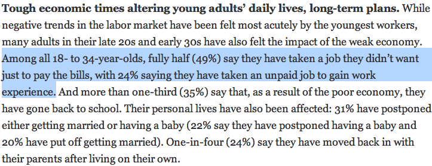
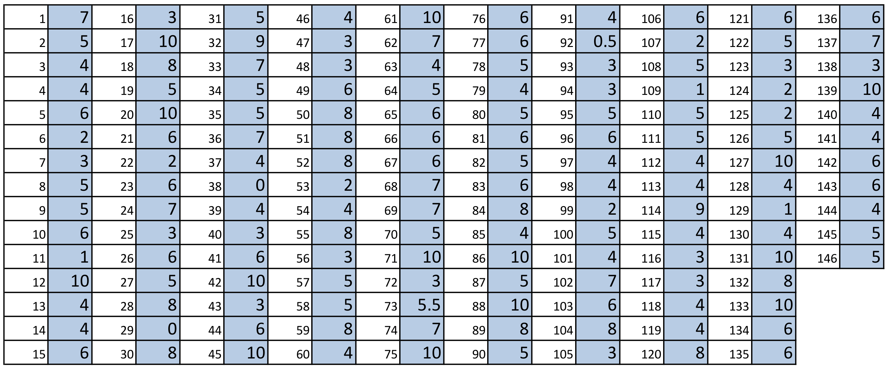
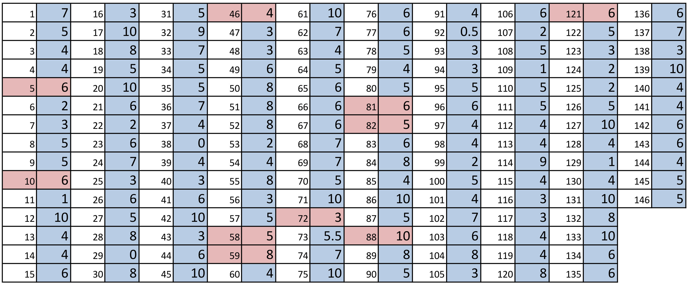

<style>
citation {
  font-size: 4px;
}
</style>

<!--  Version 1.0-0

      This version of the slides is adapted from Mine Çetinkaya-Rundel's lecture slides
      in .tex format for the Open Intro Statistics text, with some modifications, and
      moved to Rmd -> HTML.

      A large part of the HTML/CSS formatting is janky, and could be cleaned up. Feel free to issue a 
      pull request if you love HTML and CSS and want to fix this up.

      - wburr, Oct 17, 2018
-->

<!-- This is Chapter 2.1 in the IntroStat text, slides by Mine Cetinkaya-Rundel -->

# Case Study: Gender Discrimination

## Gender Discrimination

* In 1972, as a part of a study on gender discrimination, 48 male bank supervisors were each given the same personnel file and asked to judge whether the person should be promoted to a branch manager job that was described as “routine”.
* The files were identical except that half of the supervisors had files showing the person was male while the other half had files showing the person was female.
* It was randomly determined which supervisors got “male” applications and which got “female” applications.
* Of the 48 files reviewed, 35 were promoted.
* The study is testing whether females are unfairly discriminated against.
* Is this an observational study or an experiment?


<span style="font-size:10pt;">*B.Rosen and T. Jerdee (1974), "Influence of sex role stereotypes on personnel decisions", J.Applied Psychology, 59:9-14.*</span>

## Data

At a first glance, does there appear to be a relationship between promotion and gender?

```{r, makeOutcomeTable2_1, echo = FALSE}
library("kableExtra")
library("knitr")
options(knitr.table.format = "html") 
dt <- data.frame("Yes" = c(21, 14, 35), "No" = c(3, 10, 13), "Total" = c(24, 24, 48))
row.names(dt) <- c("Male", "Female", "")
kable(dt, align = 'ccc') %>%
  kable_styling("striped", full_width = FALSE, position = "center", font_size = 20) %>%
  add_header_above(c(" " = 1, "Promoted" = 2, " " = 1)) %>%
  group_rows("Gender", 1, 2) %>%
  group_rows("Total", 3, 3)
```

**% of males promoted**: 21 / 24 = 0.875

**% of females promoted**: 14 / 24 = 0.583

## Practice

We saw a difference of almost 30% (29.2% to be exact) between the proportion of male and female files that are promoted. Based on this information, which of the below is true?

1. If we were to repeat the experiment we will definitely see that more female files get promoted. This was a fluke.
2. Promotion is dependent on gender, males are more likely to be promoted, and hence there is gender discrimination against women in promotion decisions.
3. The difference in the proportions of promoted male and female files is due to chance, this is not evidence of gender discrimination against women in promotion decisions.
4. Women are less qualified than men, and this is why fewer females get promoted.

## Practice

We saw a difference of almost 30% (29.2% to be exact) between the proportion of male and female files that are promoted. Based on this information, which of the below is true?

1. If we were to repeat the experiment we will definitely see that more female files get promoted. This was a fluke.
2. <span id="highlight">Promotion is dependent on gender, males are more likely to be promoted, and hence there is gender discrimination against women in promotion decisions.</span>  <span style="color:red;">Maybe!</span>
3. <span id="highlight">The difference in the proportions of promoted male and female files is due to chance, this is not evidence of gender discrimination against women in promotion decisions.</span>  <span style="color:red;">Maybe!</span>
4. Women are less qualified than men, and this is why fewer females get promoted.

## Two Competing Claims

<div style="font-size:22px;">
“There is nothing going on.” (**Null Hypothesis**)

Promotion and gender are **independent**.

No gender discrimination.

Observed difference in proportions is simply due to chance.

<hr>
<center>**versus**</center>
<hr>

There is something going on.” (**Alternative Hypothesis**)

Promotion and gender are **dependent**.

There is gender discrimination.

Observed difference in proportions is not due to chance.
</div>

## We Will Return!

We will continue with the concept of hypothesis testing later (Lecture #14),
and again over the following weeks. 
First, lets develop some other ideas about sampling distributions.

# Variability in estimates

## $\;$
<div style = "margin-top: -90px;">
<center>
<br />
<br />
<br />
</center>
</div>

<center>
<span style="font-size:10pt; font-style: oblique; ">http://pewresearch.org/pubs/2191/young-adults-workers-labor-market-pay-careers-advancement-recession</span>
</center>

## Margin of error

<center>

</center>

* 41% $\pm$ 2.9%: We are 95% confident that 38.1% to 43.9% of the public believe young adults, rather than middle-aged or older adults, are having the toughest time in today's economy.
* 49% $\pm$ 4.4%: We are 95% confident that 44.6% to 53.4% of 18-34 years olds have taken a job they didn't want just to pay the bills.

## Parameter estimation

* We are often interested in **population parameters**.
* Since complete populations are difficult (or impossible) to collect data on, we use **sample statistics** as **point estimates** for the unknown population parameters of interest.
* Sample statistics vary from sample to sample.
* Quantifying how sample statistics vary provides a way to estimate the **margin of error** associated with our point estimate.
* But before we get to quantifying the variability among samples, let's try to understand how and why point estimates vary from sample to sample.

## Parameter estimation

Suppose we randomly sample 1,000 adults from each state in the US. Would
you expect the sample means of their heights to be the same, somewhat different, or very different?

**Not the same, but only somewhat different.**


## $\;$

<div style="margin-top: -100px;">
The following histogram shows the distribution of number of drinks it takes a group of college students to get drunk. We will assume that this is our population of interest. If we randomly select observations from this data set, which values are most likely to be selected (which are least likely)?

<center>

</center>
</div>

## $\;$

<div style="margin-top: -100px;">
Suppose that you don't have access to the population data. In order to estimate the average number of drinks it takes these college students to get drunk, you might sample from the population and use your sample mean as the best guess for the unknown population mean.

* Sample, with replacement, ten students from the population, and record the number of drinks it takes them to get drunk.
* Find the sample mean.
* Plot the distribution of the sample averages  obtained by members of the class.

</div>

## $\;$

<center>

</center>

## $\;$

**Example:** List of random numbers: 59, 121,  88,  46,  58,  72,  82,  81,   5,  10 

<center>

</center>
<br/>

**Sample mean**: $\frac{8+6+10+4+5+3+5+6+6+6}{10} = 5.9$

## Sampling distribution

What you just constructed is called a *sampling distribution*.

What is the shape and center of this distribution? Based on this distribution, what do you think is the true population average?

## Sampling distribution

What you just constructed is called a *sampling distribution*.

What is the shape and center of this distribution? Based on this distribution, what do you think is the true population average?

**Approximately 5.39, the true population mean.**

# Sampling distributions - via CLT

## Central limit theorem

**Central limit theorem**
The distribution of the sample mean is well approximated by a normal model:
$$
\bar{x} \sim \mathcal{N} \left(\text{mean} = \mu, \text{SE} = \frac{\sigma}{\sqrt{n}} \right),
$$
where SE is represents **standard error**, which is defined as the standard deviation of the sampling distribution. If $\sigma$ is unknown, use $s$ (recall: standard deviation of sample).

## Central limit theorem

* It wasn't a coincidence that the sampling distribution we saw earlier was symmetric, and centered at the true population mean.
* We won't go through a detailed proof of why $SE =  \frac{\sigma}{\sqrt{n}}$, but note that as $n$ increases $SE$ decreases. 
    - As the sample size increases we would expect samples to yield more consistent sample means, hence the variability among the sample means would be lower.

## CLT - conditions

Certain conditions must be met for the CLT to apply:

* **Independence:** Sampled observations must be independent. 
This is difficult to verify, but is more likely if
    - random sampling/assignment is used, and
    - if sampling without replacement, $n$ $<$ 10\% of the population.

## CLT - conditions

Certain conditions must be met for the CLT to apply:

* **Independence:** Sampled observations must be independent. 
This is difficult to verify, but is more likely if
    - random sampling/assignment is used, and
    - if sampling without replacement, $n$ $<$ 10\% of the population.
* **Sample size/skew:** Either the population distribution is normal, or if the population distribution is skewed, the sample size is large.
This is also difficult to verify for the population, but we can check it using the sample data, and assume that the sample mirrors the population.
    - the more skewed the population distribution, the larger sample size we need for the CLT to apply
    - for moderately skewed distributions $n>30$ is a widely used rule of thumb

## Enjoy your Break!!

Enjoy the Reading Week, and make sure to take a little bit of time for yourself.
This semester (and school year) is a marathon, not a sprint - pace yourselves,
stay hydrated, and remember to eat good calories. 