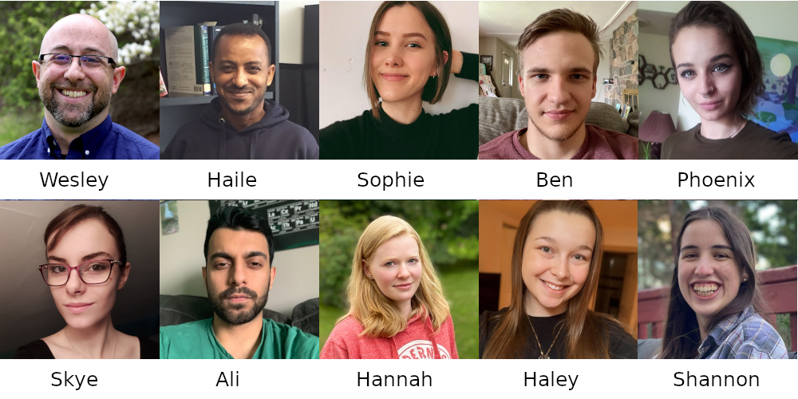

# Week 01

## What is this video?

Why am I making these videos? 

## Schedule

* Friday 11th - first lecture (introduction) posted
* Monday 14th - second lecture (chapter 1) posted
* Tuesday 15th - in-person overview of second lecture, plus commentary
* Tuesday 15th / Wednesday 16th - first in-person workshop

PDF posted on Blackboard with full details of the next six weeks.

## To Do List

* review Welcome Messages 01 through 04, and:

    - make sure RStudio is accessible and working before Tuesday 15th
    - get access to WeBWorK, find the first assignment (don't start yet!)
    - get access to Teams (say hi!)

* academic integrity

## Coming Up

* first WeBWorK assignment is due on the 18th (vocab)
* first in-person video chat with profs on Tuesday at 3pm
* first in-person workshop on Tuesday/Wednesday (scheduled time!)
* academic integrity module needs to be finished by September 21st

## Other Details?

* TA and prof office hours start next week
    
    - what is an office hour?
    - how does it work?
    - who can use it?

## Introduction to your Team

* Professors: Dr. Wesley Burr and Dr. Haile Gessesse
* Lab Demonstrators: Sophie Castel, Skye Griffith, Khalil Abuosba, Shannon Jarvis
* Academic Assistants and Student Tutors: Haley Gilchrist, Ben Ott, Phoenix Armstrong, Ali Ahmadzai,
Hannah Wood

We will all be in Teams regularly doing support time with you - in fact, Haley, Ben, Phoenix,
Ali, and Hannah have scheduled office hours on the PDF I mentioned above.

## Pictures and Introductions

<div style= "float:center; position: relative; top:-20px; right:10px;">
```{r, echo=FALSE, out.width = "1000px"}

```
</div>